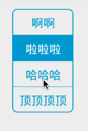
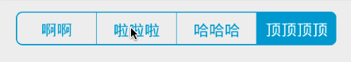

### 中文

# a simple SegmentControl Widget




## 使用：

### 添加依赖到build.gradle：


```groovy
dependencies {
    implementation 'com.zxn.segmentcontrol:segment-control:1.0.0'
}
```

**相关属性:**

* **selectedColor** 设置选中后的颜色
* **normalColor** 设置未选中的颜色
* **textColors** 设置文字内容的颜色，可以使用ColorStateList来设置选中和未选中的颜色，这个属性设置以后，之前设置的selectedColor和normalColor对文字内容失去作用
* **backgroundColors** 设置边框、选中的背景和分割线的颜色，可以使用ColorStateList来同事设置选中和未选中的颜色，和textColors一样，设置这个属性后，selectedColor和normalColor会对边框和背景失去作用
* **selectedDrawable** 设置选中后的选中的背景图,设置后selectedColor会失效,backgroundColors中选中时的颜色会失效.

* **cornerRadius** 设置背景的圆角半径,默认没有圆角.
* **boundWidth** 设置边框的粗细
* **separatorWidth** 设置分割线的粗细
* **texts** 设置文字内容，通过'|'分隔开
* **verticalGap** 纵向上的边距
* **horizonGap** 横向的边距

横向的用法
``` xml
<com.zxn.segmentcontrol.SegmentControl
    android:id="@+id/segment_control"
    android:layout_width="wrap_content"
    android:layout_height="wrap_content"
    android:orientation="horizontal"
    android:textSize="13sp"
    app:cornerRadius="5dip"
    app:horizonGap="8dip"
    app:normalColor="#FFFFFF"
    app:selectedColor="#0099CC"
    app:texts="啊啊|啦啦啦|哈哈哈|顶顶顶顶"
    app:verticalGap="8dip" />
```
纵向的用法
```
<com.zxn.segmentcontrol.SegmentControl
    android:id="@+id/sc_vertical"
    android:layout_width="0dp"
    android:layout_height="wrap_content"
    android:layout_marginTop="20dp"
    android:layout_weight="1"
    android:orientation="vertical"
    android:textSize="14sp"
    app:backgroundColors="@color/bg_color_sc_region"
    app:boundWidth="0dp"
    app:cornerRadius="0dp"
    app:selectedDrawable="@drawable/bg_rb_d_single_checked"
    app:separatorWidth="0dp"
    app:textColors="@color/text_color_sc_rgion"
    app:verticalGap="20dp" />
```

使用OnSegmentControlClickListener来监听选中的变换

```java
mSegmentHorzontal = (SegmentControl) findViewById(R.id.segment_control);
mSegmentHorzontal.setOnSegmentControlClickListener(new SegmentControl.OnSegmentControlClickListener() {
    @Override
    public void onSegmentControlClick(int index) {
        Log.i(TAG, "onSegmentControlClick: index = " + index);
    }
});
```
代码设置填充数据类:
```
String[] names = {"富贵厅", "吉祥厅", "状元厅", "安宁厅", "双喜厅", "状元厅"};
segmentInfoList = new ArrayList<>();
for (int i = 0; i < names.length; i++) {
    FoodInfo foodInfo = new FoodInfo();
    foodInfo.name = names[i];
    segmentInfoList.add(foodInfo);
}

sc_vertical.setNewData(segmentInfoList);
sc_vertical.setSelectedIndex(0);
```


